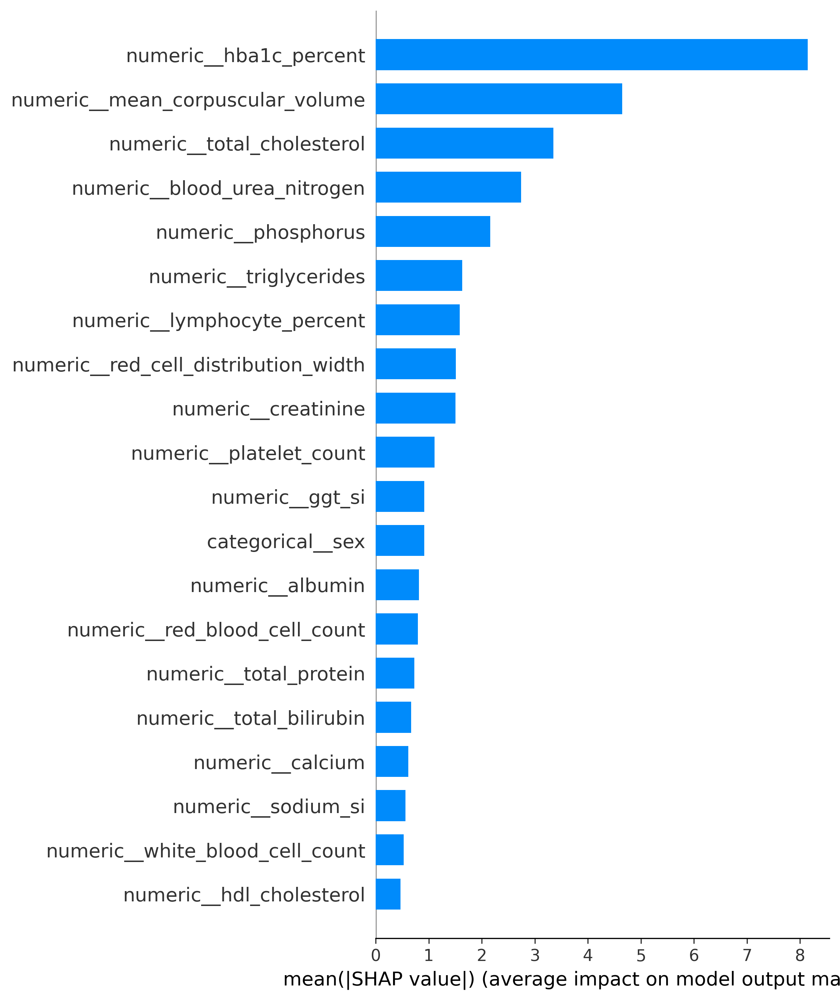
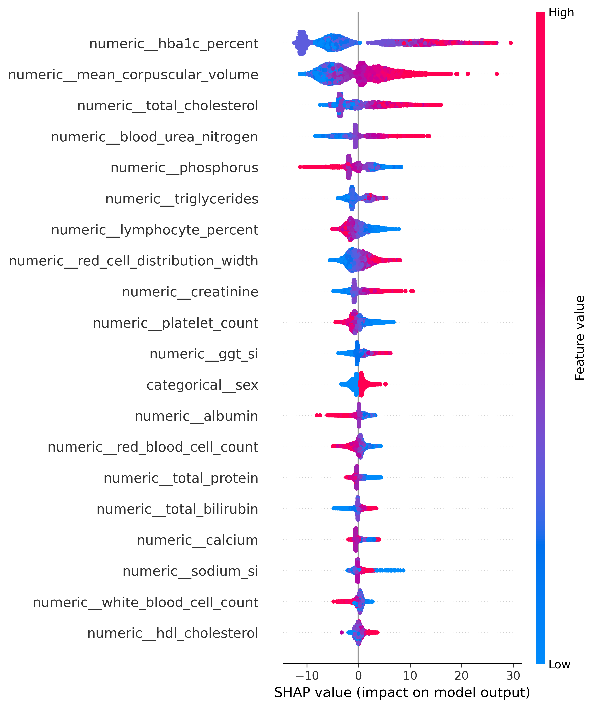
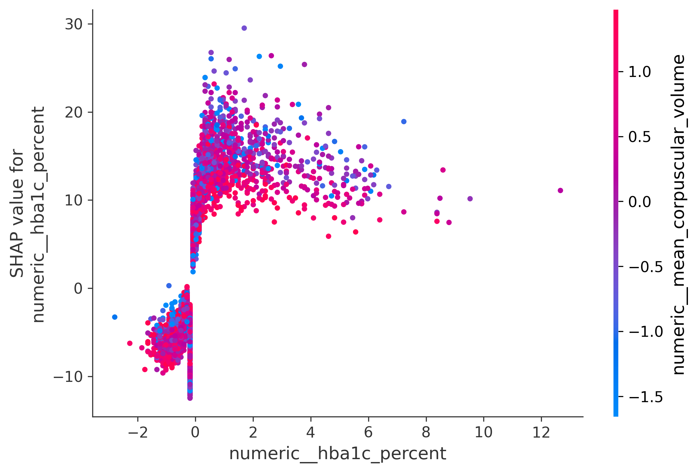
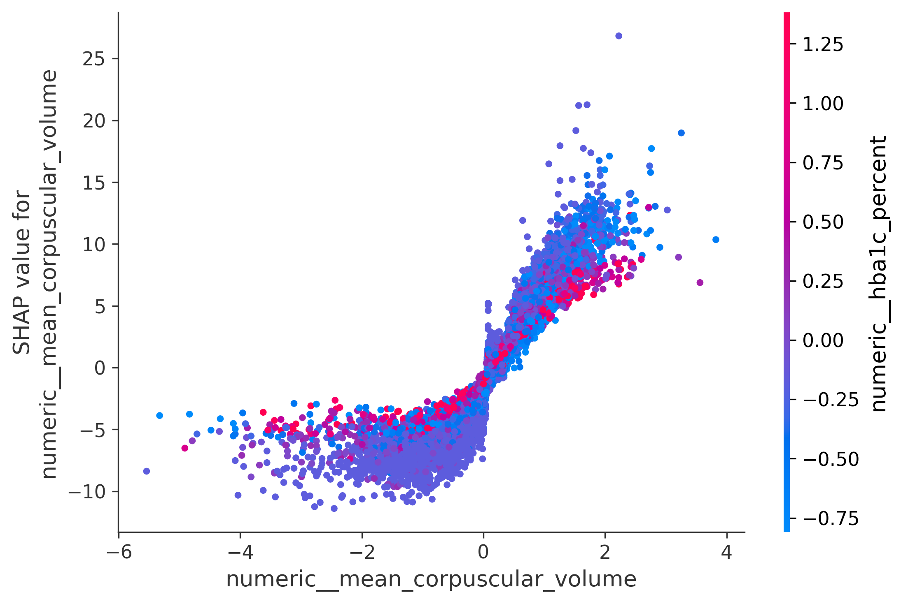

# 🧬 Biological Age Prediction using NHANES Biomarkers

> An end-to-end machine learning project for predicting chronological age from clinical laboratory biomarkers using the National Health and Nutrition Examination Survey (NHANES).

This project demonstrates a production-style machine learning workflow, including:

- Data engineering
- Feature engineering
- Hyperparameter optimization
- Explainable AI (SHAP)
- Modular project architecture
- Model versioning

---

# Project Overview

Aging is accompanied by measurable physiological changes across multiple biological systems.

This project investigates whether routinely collected blood biomarkers can accurately predict chronological age and provide a foundation for future biological age estimation.

Unlike a notebook-only implementation, this project is organized as a reusable machine learning pipeline with separate modules for data processing, preprocessing, feature engineering, model training, evaluation, and explainability.

---

# Dataset

### Source

National Health and Nutrition Examination Survey (NHANES)

### Study Period

2011–2020

### Final Dataset

| Metric              |             Value |
| ------------------- | ----------------: |
| Participants        |            36,992 |
| Original Features   |                27 |
| Engineered Features |                31 |
| Target              | Chronological Age |

---

# Machine Learning Pipeline

```text
Raw NHANES Data
        │
        ▼
Load & Merge Data
        │
        ▼
Dataset Creation
        │
        ▼
Feature Engineering
        │
        ▼
Feature Selection
        │
        ▼
Train/Test Split
        │
        ▼
Preprocessing Pipeline
        │
        ▼
Hyperparameter Tuning
        │
        ▼
Model Evaluation
        │
        ▼
SHAP Interpretation
```

---

# Feature Engineering

Three biologically motivated biomarkers were engineered:

| Engineered Feature       | Formula                          |
| ------------------------ | -------------------------------- |
| BUN / Creatinine Ratio   | Blood Urea Nitrogen ÷ Creatinine |
| Cholesterol / HDL Ratio  | Total Cholesterol ÷ HDL          |
| Triglyceride / HDL Ratio | Triglycerides ÷ HDL              |

These clinically meaningful ratio features improved predictive performance compared to the tuned baseline model.

---

# Models Evaluated

- Random Forest Regressor
- XGBoost Regressor
- LightGBM Regressor

Hyperparameter optimization was performed using **RandomizedSearchCV**.

---

# Model Performance

| Model                              |      MAE |      RMSE |        R² |
| ---------------------------------- | -------: | --------: | --------: |
| Random Forest                      |     8.05 |     11.30 |     0.777 |
| Tuned XGBoost (V1)                 |     7.71 |     10.75 |     0.798 |
| Tuned LightGBM                     |     7.71 |     10.73 |     0.799 |
| ⭐ Feature Engineered XGBoost (V2) | **7.56** | **10.67** | **0.801** |

---

# Feature Engineering Impact

| Metric | Before |     After |
| ------ | -----: | --------: |
| MAE    |   7.71 |  **7.56** |
| RMSE   |  10.75 | **10.67** |
| R²     |  0.798 | **0.801** |

Feature engineering consistently improved model performance across all evaluation metrics.

---

# SHAP Explainability

Global and local model interpretation was performed using SHAP.

## Global Feature Importance



---

## SHAP Beeswarm



---

## Feature Dependence

### HbA1c



### Mean Corpuscular Volume



---

# Key SHAP Findings

The SHAP analysis identified several important biological patterns:

- HbA1c was the strongest predictor of age.
- Mean Corpuscular Volume showed a pronounced nonlinear relationship with aging.
- Total Cholesterol and Blood Urea Nitrogen were among the most influential biomarkers.
- Phosphorus demonstrated an inverse relationship with predicted age.
- Tree-based boosting successfully captured complex nonlinear interactions that traditional linear models would likely miss.

---

# Repository Structure

```text
biological-age-prediction/

├── data/
│   ├── raw/
│   ├── interim/
│   └── processed/
│
├── models/
│   ├── tuned/
│   ├── feature_engineered/
│   └── final/
│
├── notebooks/
│
├── outputs/
│   ├── metrics/
│   ├── plots/
│   ├── reports/
│   └── tuning/
│
├── src/
│   └── biological_age/
│       ├── data/
│       ├── features/
│       ├── preprocessing/
│       ├── models/
│       ├── evaluation/
│       ├── interpret/
│       ├── split/
│       └── utils/
│
├── tests/
├── Dockerfile
├── config.yaml
├── main.py
└── README.md
```

---

# Technologies

### Data

- Pandas
- NumPy

### Machine Learning

- Scikit-learn
- XGBoost
- LightGBM

### Explainability

- SHAP

### Engineering

- Pytest
- Docker
- Git
- GitHub Actions

---

# Reproducibility

Clone the repository

```bash
git clone https://github.com/AnujCh07ML/biological-age-prediction.git
```

Create a virtual environment

```bash
python -m venv .venv
```

Activate

```bash
source .venv/bin/activate
```

Install

```bash
pip install -r requirements.txt
```

Install package

```bash
pip install -e .
```

Run pipeline

```bash
python main.py
```

---

# Current Project Status

## Completed

- NHANES data ingestion
- Multi-cycle data harmonization
- Feature preprocessing
- Baseline model development
- Hyperparameter optimization
- SHAP explainability
- Biological feature engineering
- Versioned model artifacts

---

# Next Steps

- FastAPI model serving
- Docker deployment
- GitHub Actions CI/CD
- Model monitoring
- Biological age proxy development
- External dataset validation

---

# Author

**Anuj Chauhan**

Machine Learning | Bioinformatics | Explainable AI

Interested in machine learning applications for aging research, computational biology, and biomedical data science.

---

# License

MIT License
